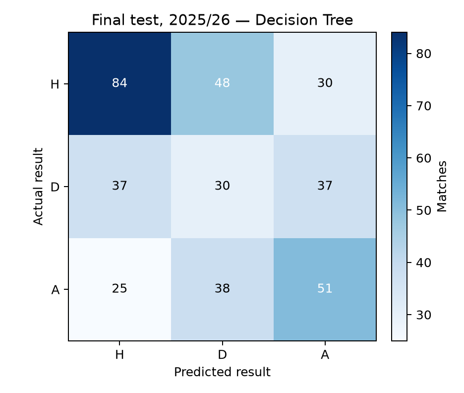

# Premier League Match Outcome Predictor

A reproducible, pre-kickoff machine-learning study of English Premier League results: **home win (`H`), draw (`D`), or away win (`A`)**. The pipeline uses historical results and compares five classical classifiers. It is designed to make feature timing, evaluation choices, and limitations inspectable.

## Held-out result

The model was selected using earlier seasons and evaluated once on all 380 fixtures in the reserved 2025/26 season.

| Selected model | Accuracy | Balanced accuracy | Macro F1 | Log loss | Macro OVR ROC AUC |
| --- | ---: | ---: | ---: | ---: | ---: |
| Decision Tree | 0.434 | 0.418 | 0.419 | 1.053 | 0.609 |
| Majority / always-home baseline | 0.426 | 0.333 | 0.199 | — | — |

The final confusion matrix shows the largest error group was 48 home wins predicted as draws; draw recall was 0.288. The validation-selected Decision Tree improved macro F1 over the baseline, but the holdout result is modest and does not establish future performance.



See the [final-season ROC curves](reports/final_test_roc.png) for one-vs-rest class discrimination.

See the [full report](reports/project_report.md), [validation comparison](reports/validation_model_comparison.csv), [fold dates and scores](reports/validation_fold_scores.csv), and [final metrics](reports/final_test_metrics.json). The report also includes per-model validation confusion matrices, Logistic Regression coefficients, Decision Tree split rules, Random Forest and XGBoost feature importance, and an Elo ablation.

## Method

The audit covers 12,704 fixtures across 33 seasons (1993/94–2025/26). Predictors are five-match points and goal form, venue-specific form, rest days, prior head-to-head count, and pre-match Elo difference. Current-match result fields are labels and historical state updates only; they never enter that fixture's feature row. Same-date fixtures share one prior-history snapshot.

Model selection uses date-blocked expanding-window validation. Logistic Regression, a bounded Gini Decision Tree, Random Forest, XGBoost, and an RBF SVM are compared by macro F1 and log loss. Imputation and scaling remain inside each fold. The 2025/26 holdout is excluded from tuning. See the [feature contract](docs/feature_contract.md) and [data audit](reports/data_audit.json) for definitions, actual source headers, checks, and hashes.

The validation-only Elo ablation changed mean macro F1 from 0.368 without Elo to 0.465 with all features for the selected model. This is a descriptive experiment on the model-selection folds, not an independent or causal estimate.

The key methodological safeguard is explicit feature availability: same-fixture performance statistics are excluded, and every feature uses completed matches from earlier dates only. Fixtures on one date are also kept together during validation.

## Interactive forecast UI

The `web/` app is a Next.js and React interface for the same Python model. Browse the complete 2026/27 schedule by matchweek or club, then click **Predict** beside an upcoming fixture. Teams and kickoff dates come from the stored schedule; no manual date entry is required. Completed matches show their scores. The service retrains the validation-selected Decision Tree on all completed results currently on disk; it rejects dates on or before the latest result so a forecast cannot use a match outcome from its own future. The 2025/26 holdout metrics remain the historical benchmark even when that season is later included in the deployment model.

To run both services locally, first install the Python dependencies as described below. In one terminal, from the repository root:

```sh
python -m pip install --no-deps -e .
python -m premier_league_predictor download --through-year 2026
python -m premier_league_predictor fixtures
python -m premier_league_predictor.api
```

The downloader includes the in-progress 2026/27 season. Scheduled rows without a result are ignored; completed results update the model's form and Elo history. The `fixtures` command refreshes all 380 fixtures from Fixture Download and validates the complete schedule before replacing the snapshot. Restart the Python service after refreshing results or fixtures. The checked-in snapshot allows the fixture browser to work without fetching an external schedule at runtime.

In a second terminal:

```sh
cd web
npm ci
npm run dev
```

Open the local URL printed by Next.js. `PREDICTOR_API_URL` can point the Next.js server to a separately hosted Python API; it defaults to `http://127.0.0.1:8000`.

Kickoff times are displayed in UK time, including daylight-saving changes. Only unstarted fixtures can be predicted; completed games are not retrospective forecasts. Deployment probabilities use the latest local completed results, rather than simulated future results, so forecasts for later matchweeks should be refreshed as the season progresses. Each forecast includes an optional **Model evidence** section: the exact fitted-tree decision path, feature values (with median-imputed values identified), training leaf support, and the frozen 2025/26 held-out confusion matrix and baseline accuracy. Leaf probabilities use class-weighted training outcomes. The historical benchmark was evaluated before the deployment refit and does not establish correctness for an individual fixture.

## Project layout

```text
src/premier_league_predictor/  downloader, validation, features, model API, reports
web/                           Next.js and React forecast interface
tests/                         data, feature-timing, and date-split checks
docs/                          pre-kickoff feature contract
data/fixtures/                 stored 2026/27 schedule with source and refresh timestamp
data/raw/                      downloaded season CSVs (ignored by Git)
data/processed/                generated features (ignored by Git)
models/                        fitted estimator (ignored by Git)
reports/                       audit, metrics, figures, and project report
```

## Run locally

Python 3.12 or newer is required. On macOS, install OpenMP for XGBoost if it is not already available (`brew install libomp`). Then:

```sh
python3.12 -m venv .venv
source .venv/bin/activate
python -m pip install -r requirements-dev.txt
python -m pip install --no-deps -e .
python -m premier_league_predictor download
python -m premier_league_predictor audit
python -m pytest
python -m premier_league_predictor evaluate --n-jobs 2
```

The download command retrieves source CSVs into `data/raw/`; the audit validates them and records per-file SHA-256 hashes. Evaluation rebuilds the feature table, searches models, evaluates the selected model on the reserved season, and writes reproducible outputs to `reports/`, `models/`, and `data/processed/`. Direct dependency versions are pinned in the requirements files.

## Data and attribution

Match results come from [Football-Data.co.uk](https://www.football-data.co.uk/englandm.php). The source and the independent reference project are documented in [ATTRIBUTION.md](ATTRIBUTION.md). The reference informed data and feature-engineering choices; its code, report, and advanced-stat data were not copied.
